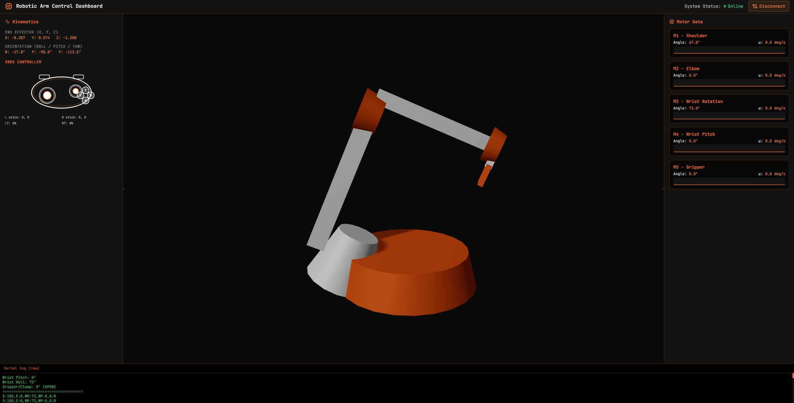

# 🦾 5-DOF Robotic Arm Controller

Arduino-based robotic arm controller using Xbox controller via USB Host Shield. Control 5 servo motors with intuitive joystick and trigger inputs. Includes a **Web GUI dashboard** for real-time 3D visualization, kinematics, motor telemetry, and live Xbox controller input.


## 📋 Table of Contents

- [Overview](#overview)
- [Web GUI (Dashboard)](#-web-gui-dashboard)
- [Hardware Requirements](#hardware-requirements)
- [Motor Configuration](#motor-configuration)
- [Wiring Diagram](#wiring-diagram)
- [Controller Mapping](#controller-mapping)
- [Installation](#installation)
- [Usage](#usage)
- [Serial Monitor Output](#serial-monitor-output)
- [Troubleshooting](#troubleshooting)
- [License](#license)

## 🎯 Overview

This project enables real-time control of a 5-degree-of-freedom (5-DOF) robotic arm using an Xbox 360 controller. The system uses:

- **1 Shoulder motor** - Vertical arm movement
- **1 Elbow motor** - Horizontal arm extension
- **2 Wrist motors** - Pitch (up/down) and roll (rotation)
- **1 Gripper motor** - Clamp open/close

All motors are controlled simultaneously with smooth, responsive movements and real-time position feedback via Serial Monitor.

---

## 🖥️ Web GUI (Dashboard)

A browser-based **Robotic Arm Control Dashboard** lets you visualize the arm in 3D, see live kinematics and motor data, and watch Xbox controller input in real time—all over the same serial connection as the Arduino.

### Screenshot



> **To show the screenshot on GitHub:** add your dashboard screenshot to the **repo root** as `robo_gui.png`, then commit and push.

### What the dashboard does

- **3D view:** Renders the 5-DOF arm (shoulder, elbow, wrist rotation, wrist pitch, gripper) with white/orange styling. Pose updates live from serial; you can orbit the camera with the mouse.
- **Kinematics (left panel):** Shows computed **End Effector (X, Y, Z)** and **Orientation (Roll / Pitch / Yaw)** from the current joint angles.
- **Xbox controller (left panel):** Live view of sticks, triggers (LT/RT), and A/B/X/Y buttons in a white/orange controller graphic with animated indicators.
- **Motor data (right panel):** Five cards—one per servo—with current angle (0°–180°), angular velocity (ω in deg/s), and a sparkline of recent movement.
- **Resizable panels:** Drag the vertical dividers between the left panel, center, and right panel to resize; content reflows.
- **Serial log (bottom):** Raw lines from the Arduino (servo lines and CTRL lines) in a terminal-style log.

### How to install and run the Web GUI

**Prerequisites:** [Node.js](https://nodejs.org/) (LTS) and npm.

1. **Clone or open the repo** (e.g. [thecrazyphysicist369/robo_painter](https://github.com/thecrazyphysicist369/robo_painter)).

2. **Install dependencies and start the dev server:**
   ```bash
   cd dashboard
   npm install
   npm run dev
   ```

3. **Open the app** in your browser at the URL shown (e.g. `http://localhost:5173`).

4. **Connect the Arduino:**
   - Ensure the Arduino is running the sketch that sends the **compact serial format** (see [Arduino output format](#arduino-output-format-for-the-dashboard) below) at **115200** baud.
   - In the dashboard, click **Connect Serial**, choose your Arduino’s COM port, and connect.

5. **Use the dashboard:** The 3D arm, kinematics, controller view, and motor cards update live. Drag the dividers between the left/center/right areas to resize panels.

**Browser support:** The dashboard uses the **Web Serial API**. Use **Chrome** or **Edge** on **localhost** or **HTTPS**. Other browsers do not support Web Serial.

### Arduino output format for the dashboard

The dashboard expects two line formats from the Arduino (e.g. every ~50 ms when the Xbox controller is connected):

1. **Servo positions:**  
   `S:<angle>,E:<angle>,WR:<angle>,WP:<angle>,G:<angle>`  
   Example: `S:90,E:75,WR:110,WP:120,G:45`

2. **Controller state (optional but recommended for the Xbox view):**  
   `CTRL:LX:<val>,LY:<val>,RX:<val>,RY:<val>,LT:<val>,RT:<val>,A:<0|1>,B:<0|1>,X:<0|1>,Y:<0|1>`  
   Sticks are -100..100, triggers 0..100, face buttons 0 or 1.

The sketch in `robotic_arm_5motor_/robotic_arm_5motor_.ino` in this repo already sends both when the controller is connected. Re-flash that sketch if the dashboard does not update or the controller panel stays at zero.

### Tech stack (dashboard)

- **React** + **Vite** + **Tailwind CSS**
- **Three.js** via `@react-three/fiber` and `@react-three/drei`
- **Web Serial API** for COM port access
- **Lucide React** for icons

---

## 🔧 Hardware Requirements

### Components

| Component | Quantity | Notes |
|-----------|----------|-------|
| Arduino Uno/Mega | 1 | Any Arduino with USB Host Shield support |
| USB Host Shield | 1 | For Xbox controller communication |
| Xbox 360 Controller | 1 | Wired USB connection |
| Servo Motors | 5 | Standard 180° servos (e.g., SG90, MG996R) |
| External 5V Power Supply | 1 | 5V/3A or higher (servos draw ~500mA each) |
| Jumper Wires | - | For connections |
| Breadboard (optional) | 1 | For organized wiring |

### Power Requirements

⚠️ **CRITICAL:** Servos must be powered externally. Arduino's 5V pin cannot provide sufficient current for 5 motors.

- **Recommended:** 5V/5A power supply
- **Minimum:** 5V/3A power supply
- **Must:** Connect common ground between Arduino and external power supply

## 📊 Motor Configuration

### Pin Assignments

| Motor | Arduino Pin | Joint | Function |
|-------|-------------|-------|----------|
| **Shoulder** | Pin 3 | Joint 1 | Vertical arm movement (up/down) |
| **Elbow** | Pin 5 | Joint 2 | Horizontal arm extension (left/right) |
| **Wrist Pitch** | Pin 6 | Joint 3 | Wrist vertical angle (up/down) |
| **Wrist Roll** | Pin 9 | Joint 4 | Wrist rotation (twist) |
| **Gripper** | Pin 10 | Clamp | Open/close gripper |

### Initial Positions

All servos initialize to **90° (center position)** on startup for safe operation.

## 🔌 Wiring Diagram

```
┌─────────────────────────────────────────────────────────────────┐
│                     ARDUINO UNO/MEGA                            │
│                                                                 │
│  Pin 3  ────────────────────> Shoulder Servo (Signal - Orange) │
│  Pin 5  ────────────────────> Elbow Servo (Signal - Orange)    │
│  Pin 6  ────────────────────> Wrist Pitch (Signal - Orange)    │
│  Pin 9  ────────────────────> Wrist Roll (Signal - Orange)     │
│  Pin 10 ────────────────────> Gripper (Signal - Orange)        │
│                                                                 │
│  GND    ────────┐                                               │
│                 │                                               │
│  [USB Host Shield Stacked on Top]                              │
│       └─> Xbox Controller (USB)                                │
└─────────────────┼───────────────────────────────────────────────┘
                  │
                  │  COMMON GROUND (CRITICAL!)
                  │
┌─────────────────┴───────────────────────────────────────────────┐
│              EXTERNAL 5V POWER SUPPLY                           │
│                                                                 │
│  (+) 5V ─────────────────────> All Servo RED Wires             │
│  (-) GND ────────┬───────────> All Servo BROWN/BLACK Wires     │
│                  └───────────> Arduino GND Pin                  │
└─────────────────────────────────────────────────────────────────┘
```

### Servo Wire Colors

| Wire Color | Connection |
|------------|------------|
| 🔴 **Red/Orange** | Power (5V from external supply) |
| 🟤 **Brown/Black** | Ground (common ground) |
| 🟠 **Orange/Yellow/White** | Signal (Arduino PWM pin) |

### Critical Wiring Notes

⚠️ **MUST connect Arduino GND to External Power Supply GND** - This is the most common cause of servo jittering or malfunction!

✅ All servo power (red wires) → External 5V (+)  
✅ All servo grounds (brown/black) → External 5V (-) **AND** Arduino GND  
✅ All servo signals → Respective Arduino pins

## 🎮 Controller Mapping

```
        Xbox Controller Layout
        
    ┌─────────────────────────┐
    │   LT          RT         │  ← Triggers
    │   ▼           ▼          │
    │                          │
    │  ◄►           (Y)        │
    │   ↑    [☼]              │
    │  ◄►          (X) (B)     │
    │   ↓           (A)        │
    │        [⧉]         ◄►    │
    │                     ↑    │
    │  Left Stick      ◄►      │
    │                     ↓    │
    │                          │
    │              Right Stick │
    └─────────────────────────┘
```

### Control Scheme

| Input | Control | Function |
|-------|---------|----------|
| **Left Joystick** ⬆️⬇️ | Shoulder Joint | Move arm up/down |
| **Left Joystick** ⬅️➡️ | Elbow Joint | Extend/retract arm |
| **Right Joystick** ⬆️⬇️ | Wrist Pitch | Tilt wrist up/down |
| **Right Joystick** ⬅️➡️ | Wrist Roll | Rotate wrist |
| **LT (Left Trigger)** 🎯 | Gripper | **Close** gripper |
| **RT (Right Trigger)** 🎯 | Gripper | **Open** gripper |

### Movement Characteristics

- **Speed:** 2° per update cycle (adjustable in code)
- **Deadzone:** 7500 (prevents drift from neutral joystick position)
- **Range:** 0° to 180° for all servos
- **Update Rate:** 15ms between updates

## 📥 Installation

### 1. Install Arduino IDE

Download from [arduino.cc](https://www.arduino.cc/en/software)

### 2. Install Required Library

Open Arduino IDE:

1. Go to **Sketch** → **Include Library** → **Manage Libraries**
2. Search: `USB Host Shield Library 2.0`
3. Install: **USB Host Shield Library 2.0** by **Oleg Mazurov**
4. Click **Install**

### 3. Upload Code

1. Connect Arduino to computer via USB
2. Open `robotic_arm_5motor_corrected.ino`
3. Select your board: **Tools** → **Board** → **Arduino Uno** (or your model)
4. Select port: **Tools** → **Port** → **COM# (Arduino)**
5. Click **Upload** ➜

### 4. Hardware Setup

1. Stack USB Host Shield on Arduino
2. Connect 5 servos to respective pins (see wiring diagram)
3. Connect external 5V power supply
4. **Connect grounds together** (Arduino GND to Power Supply GND)
5. Plug Xbox controller into USB Host Shield

## 🚀 Usage

### Starting the System

1. **Power on** Arduino with USB or DC adapter
2. **Open Serial Monitor** (Tools → Serial Monitor or `Ctrl+Shift+M`)
3. **Set baud rate** to **115200**
4. Wait for message: `"Waiting for Xbox controller..."`
5. **Plug in Xbox controller** to USB Host Shield
6. See: `"*** XBOX CONTROLLER CONNECTED! ***"`
7. **Start controlling** the robotic arm!

### Operating Tips

✅ **Smooth movements:** Small joystick movements = precise control  
✅ **Trigger pressure:** Light press = slow gripper, full press = fast gripper  
✅ **Emergency stop:** Unplug controller or power supply  
✅ **Reset position:** Restart Arduino to return all servos to 90°

## 📺 Serial Monitor Output

The system displays servo positions **every 1 second**:

```
========== SERVO POSITIONS ==========
Shoulder Joint:    90°
Elbow Joint:       75°
Wrist Pitch:       120°
Wrist Roll:        110°
Gripper/Clamp:     150° (CLOSED)
====================================
```

### Gripper Status Indicators

| Position | Status |
|----------|--------|
| 0° - 59° | **OPEN** |
| 60° - 119° | **PARTIAL** |
| 120° - 180° | **CLOSED** |

## 🔍 Troubleshooting

### Problem: Servos Jitter/Twitch

**Solution:**
- ✅ Check common ground connection between Arduino and power supply
- ✅ Add 100µF-470µF capacitor across servo power lines
- ✅ Use higher current power supply (5V/5A recommended)
- ✅ Increase `deadzone` value in code (line 48)

### Problem: Controller Not Detected

**Solution:**
- ✅ Check USB Host Shield is properly seated on Arduino
- ✅ Use wired Xbox 360 controller (wireless requires different setup)
- ✅ Try different USB cable
- ✅ Check Serial Monitor shows "USB Host Shield initialized"

### Problem: Servos Not Moving

**Solution:**
- ✅ Verify external 5V power supply is on
- ✅ Check servo signal wires connected to correct pins
- ✅ Ensure servos are functional (test individually)
- ✅ Check Serial Monitor for position updates

### Problem: Erratic Movement

**Solution:**
- ✅ Adjust `normalSpeed` value (line 49) - reduce for smoother movement
- ✅ Increase `deadzone` (line 48) to prevent small drift
- ✅ Add small delay: change `delay(15)` to `delay(20)` (line 172)

### Problem: Upload Fails

**Solution:**
- ✅ Remove USB Host Shield during upload, reconnect after
- ✅ Select correct board and port in Tools menu
- ✅ Close Serial Monitor before uploading
- ✅ Press reset button on Arduino before upload

## 📝 Code Customization

### Adjusting Movement Speed

```cpp
// Line 49-50
const int normalSpeed = 2;  // Change to 1 (slower) or 5 (faster)
const int fastSpeed = 4;    // Gripper speed
```

### Changing Servo Limits

```cpp
// Line 39-40
const int minPos = 0;    // Minimum angle
const int maxPos = 180;  // Maximum angle
```

### Adjusting Deadzone Sensitivity

```cpp
// Line 48
const int deadzone = 7500;  // Increase to reduce sensitivity
                           // Decrease for more responsive control
```

### Inverting Servo Direction

To reverse a servo's direction, change its movement line:

```cpp
// For example, to invert Shoulder (line 127):
// Original:
int movement = map(leftY, -32768, 32767, normalSpeed, -normalSpeed);

// Inverted:
int movement = map(leftY, -32768, 32767, -normalSpeed, normalSpeed);
```

## 🤝 Contributing

Contributions welcome! Please:

1. Fork the repository
2. Create a feature branch (`git checkout -b feature/AmazingFeature`)
3. Commit changes (`git commit -m 'Add AmazingFeature'`)
4. Push to branch (`git push origin feature/AmazingFeature`)
5. Open a Pull Request

## 📄 License

This project is licensed under the MIT License - see below for details:

```
MIT License

Copyright (c) 2025

Permission is hereby granted, free of charge, to any person obtaining a copy
of this software and associated documentation files (the "Software"), to deal
in the Software without restriction, including without limitation the rights
to use, copy, modify, merge, publish, distribute, sublicense, and/or sell
copies of the Software, and to permit persons to whom the Software is
furnished to do so, subject to the following conditions:

The above copyright notice and this permission notice shall be included in all
copies or substantial portions of the Software.

THE SOFTWARE IS PROVIDED "AS IS", WITHOUT WARRANTY OF ANY KIND, EXPRESS OR
IMPLIED, INCLUDING BUT NOT LIMITED TO THE WARRANTIES OF MERCHANTABILITY,
FITNESS FOR A PARTICULAR PURPOSE AND NONINFRINGEMENT. IN NO EVENT SHALL THE
AUTHORS OR COPYRIGHT HOLDERS BE LIABLE FOR ANY CLAIM, DAMAGES OR OTHER
LIABILITY, WHETHER IN AN ACTION OF CONTRACT, TORT OR OTHERWISE, ARISING FROM,
OUT OF OR IN CONNECTION WITH THE SOFTWARE OR THE USE OR OTHER DEALINGS IN THE
SOFTWARE.
```

## 🙏 Acknowledgments

- **USB Host Shield Library 2.0** by Oleg Mazurov and Circuits@Home
- Arduino Community for extensive servo control resources
- Xbox Controller protocol reverse engineering community

## 📞 Support

- **Issues:** Open an issue on GitHub
- **Questions:** Check existing issues or start a discussion
- **Documentation:** See comments in `.ino` file for detailed code explanations

---

**Built with ❤️ for robotics enthusiasts**

⭐ Star this repo if you find it helpful!
